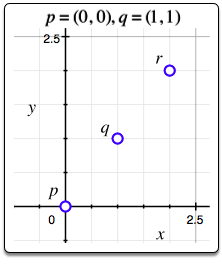
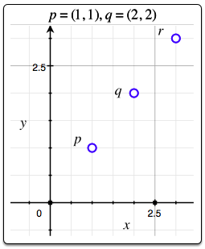

| [Previous Question](https://github.com/Kevin-Lago/python-hackerrank-solutions/tree/main/src/mathematics/)</img> | [Home](https://github.com/Kevin-Lago/python-hackerrank-solutions)</img> | [Next Question](https://github.com/Kevin-Lago/python-hackerrank-solutions/tree/main/src/mathematics/)</img> |
|:---|:---:|---:|

# Find the Point

Consider two points, $p = (p_{x}, p_{y})$ and $q = (q_{x}, q_{y})$. We consider the inversion or [point reflection](https://en.wikipedia.org/wiki/Point_reflection), $r = (r_{x}, r_{y})$, of point $p$ across point $q$ to be a $180^{\circ}$ rotation of point $p$ around $q$.

Given $n$ sets of points $p$ and $q$, find $r$ for each pair of points are print two space-separated integers denoting the respective values of $r_{x}$ and $r_{y}$ on a new line.

__Function Description__

Complete the find_point function in the editor below.

find_point has the following paramters:

- int px, py, qx, qy: x and y coordinates for points $p$ and $q$

__Returns__

- int[2]: x and y coordinates of the reflected point, $r$.

__Input Format__

The first line contains an integer, $n$, denoting the number of sets of points.

Each of the $n$ subsequent lines contains four space-separated integers that describe the respective values of $p_{x}, p_{y}, q_{x}$ and $q_{y}$ defining points $p = (p_{x}, p_{y})$ and $q = (q_{x}, q_{y})$.

__Constraints__

- $1 \le n \le 15$

- $-100 \le p_{x}, p_{y}, q_{x}, q_{y} \le 100$

__Sample Input__

```
2
0 0 1 1
1 1 2 2
``` 

__Sample Output__

```
2 2
3 3
```

__Explanation__

The graphs below depict points $p$, $q$ and $r$ for the $n = 2$ points given as Sample Input:

1. 

2. 

---

<details><summary>Solution</summary>
    
```python
import os


def find_point(px, py, qx, qy):
    rx = 2 * qx - px
    ry = 2 * qy - py

    return [rx, ry]


if __name__ == '__main__':
    fptr = open(os.environ['OUTPUT_PATH'], 'w')

    n = int(input().strip())

    for _ in range(n):
        px, py, qx, qy = map(int, input().split())

        result = find_point(px, py, qx, qy)

        fptr.write(' '.join(map(str, result)))
        fptr.write('\n')

    fptr.close()
```
</details>
