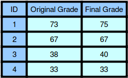

| [Previous Question](https://github.com/Kevin-Lago/python-hackerrank-solutions/tree/main/src/)</img> | [Home](https://github.com/Kevin-Lago/python-hackerrank-solutions)</img> | [Next Question](https://github.com/Kevin-Lago/python-hackerrank-solutions/tree/main/src/)</img> |
|:---|:---:|---:|

# Grading Students

HackerLand University has the following grading policy:

- Every student receives a $grade$ in the inclusive range from $0$ to $100$.

- Any $grade$ less than $40$ is a failing grade.

Sam is a professor at the university and likes to round each student's $grade$ according to these rules:

- If the difference between the $grade$ and the next multiple of $5$ is less than $3$, round $grade$ up to the next multiple of $5$.

- If the value of $grade$ is less than $38$, no rounding occurs as the result will still be a failing grade.

__Examples__

- $grade = 84$ round to $85$ (85 - 84 is less than 3)

- $grade = 29$ do not round (result is less than 40)

- $grade = 57$ do not round (60 - 57 is 3 or higher)

Given the initial value of $grade$ for each of Sam's $n$ students, write code to automate the rounding process.

__Function Description__

Complete the function grading_students in the editor below.

grading_students has the following parameter(s):

- int[n] grades: the grades before rounding

__Returns__

- int[n]: the grades after rounding as appropriate

__Input Format__

The first line contains a single integer, $n$, the number of students.

Each line $i$ of the $n$ subsequent lines contains a single integer, $grades[i]$.

__Constraints__

- $1 \le n \le 60$

- $0 \le grades[i] \le 100$

__Sample Input__

```
4
73
67
38
33
```

__Sample Output__

```
75
67
40
33
```

__Explanation__



1. Student $1$ received a $73$, and the next multiple of $5$ from $73$ is $75$. Since $75 - 73 < 3$, the student's grade is rounded to $75$.

2. Student $2$ received a $67$, and the next multiple of $5$ from $67$ is $70$. Since $70 - 67 = 3$, the grade will not be modified and the student's final grade is $67$.

3. Student $3$ received a $38$, and the next multiple of $5$ from $38$ is $40$. Since $40 - 38 < 3$, the student's grade will be rounded to $40$.

4. Student $4$ received a grade below $33$, so the grade will not be modified and the student's final grade is $33$.

---

<details><summary>Solution</summary>
    
```python
def grading_student(grades):
    rounded_grades = list()

    for grade in grades:
        if grade < 38:
            rounded_grades.append(grade)
            continue
        if (grade + (5 - grade % 5)) - grade < 3:
            rounded_grades.append(grade + (5 - grade % 5))
            continue
        rounded_grades.append(grade)

    return rounded_grades


if __name__ == '__main__':
    n: int = int(input())
    grades = list()

    for _ in range(n):
        grades.append(int(input()))

    [print(grade) for grade in grading_student(grades)]
```
</details>
