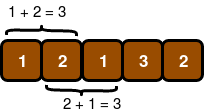

| [Previous Question](https://github.com/Kevin-Lago/python-hackerrank-solutions/tree/main/src/)</img> | [Home](https://github.com/Kevin-Lago/python-hackerrank-solutions)</img> | [Next Question](https://github.com/Kevin-Lago/python-hackerrank-solutions/tree/main/src/)</img> |
|:---|:---:|---:|

# Subarray Division

Two children, Lily and Ron, want to share a chocolate bar. Each of the squares has an integer on it.

Lily decides to share a contiguous segment of the bar selected such that:

- The length of the segment matches Ron's birth month

- The sum of the integers on the squares is equal to his birth day

Determine how many ways she can divide the chocolate.

__Example__

$s = [2, 2, 1, 3, 2]$

$d = 4$

$m = 2$

Lily wants to find segments summing to Ron's birth day, $d = 4$ with a length equalling his birth month, $m = 2$.

In this case, there are two segments meeting her criteria: $[2, 2]$ and $[1, 3]$.

__Function Description__

Complete the birthday function in the editor below.

birthday has the following parameter(s):

- int[n] s: the numbers on each of the squares of chocolate

- int d: Ron's birth day

- int m: Ron's birth month

__Returns__

- int: the number of ways the bar can be divided

__Input Format__

The first line contains an integer, $n$, the number of squares in hte chocolate bar.

The second line contains $n$ space-separated integers $s[i]$, the numbers on the chocolate squares where $0 \le i < n$

The third line contains two space-separated integers, $d$ and $m$, Ron's birth day and his birth month.

__Constraints__

- $1 \le n \le 100$

- $1 \le s[i] \le 5$ where ($0 \le i < n$)

- $1 \le d \le 31$

- $1 \le m \le 12$

__Sample Input 0__

```
5
1 2 1 3 2
3 2
```

__Sample Output 0__

```
2
```

__Explanation 0__

Lily wants to give Ron $m = 2$ squares summing to $d = 3$. The following two segments meet the criteria:



__Sample Input 1__

```
6
1 1 1 1 1 1
3 2
```

__Sample Output 1__

```
0
```

__Explanation 1__

Lily only wants to give Ron $m = 2$ consecutive squares of chocolate whose integers sum to $d = 3$. There are no possible pieces satisfying these constraints:


Thus, we print $0$ as our answer.

__Sample Input 2__

```
1
4
4 1
```

__Sample Output 2__

```
1
```

__Explanation 2__

Lily only wants to give Ron $m = 1$ square of chocolate with an integer value of $d = 4$. Because the only square of chocolate in the bar satisfies this constraint, we print $1$ as our answer.

---

<details><summary>Solution</summary>
    
```python

```
</details>
