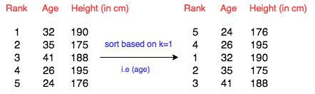

| [Previous Question](https://github.com/Kevin-Lago/python-hackerrank-solutions/tree/main/src/python/built_ins/python_evaluation)</img> | [Home](https://github.com/Kevin-Lago/python-hackerrank-solutions)</img> | [Next Question](https://github.com/Kevin-Lago/python-hackerrank-solutions/tree/main/src/python/built_ins/any_or_all)</img> |
|:---|:---:|---:|

# Athlete Sort

You are given a spreadsheet that contains a list of $n$ athletes and their details (such as age, height, weight and so on). You are required to sort the data based on the $k^th$ attribute and print the final resulting table. Follow the example given below for the better understanding.



Note that $k$ is indexed from $0$ to $m - 1$, where $m$ is the number of attributes.

__Note:__ If two attributes are the same for different rows, for example, if two atheletes are of the same age, print the row that appeared first in the input.

__Input Format__

The first line contains $n$ and $m$ separated by a space.

The next $n$ lines each contains $m$ elements.

The last line contains $k$.

__Constraints__

$1 \le n, m \le 1000$

$0 \le k < m$

$Each element \le 1000$

__Output Format__

Print the $n$ lines of the sorted table. Each line should contain the space separated elements. Check the sample below for clarity.

__Sample Input__

```
5 3
10 2 5
7 1 0
9 9 9
1 23 12
6 5 9
1
```

__Sample Output__

```
7 1 0
10 2 5
6 5 9
9 9 9
1 23 12
```

__Explanation__

The details are sorted based on the second attribute, since $k$ is zero-indexed.

---

<details><summary>Solution</summary>
    
```python

```
</details>
