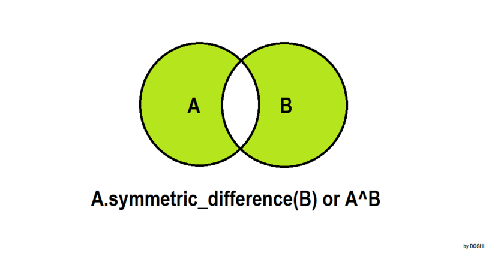

| [Previous Question](https://github.com/Kevin-Lago/python-hackerrank-solutions/tree/main/src/python/sets/set_difference_operation)</img> | [Home](https://github.com/Kevin-Lago/python-hackerrank-solutions)</img> | [Next Question](https://github.com/Kevin-Lago/python-hackerrank-solutions/tree/main/src/python/sets/set_mutations)</img> |
|:---|:---:|---:|

# Set .symmetric_difference() Operation



__.symmetric_difference()__

The .symmetric_difference() operator returns a set with all the elements that are in the set and the iterable but not both.

Sometimes, a ```^``` operator is used in place of the .symmetric_difference() tool, but it only operates on the set of elements in set.

The set is immutable to the .symmetric_difference() operation (or ```^``` operation).

```python
>>> s = set("Hacker")
>>> print s.symmetric_difference("Rank")
set(['c', 'e', 'H', 'n', 'R', 'r'])

>>> print s.symmetric_difference(set(['R', 'a', 'n', 'k']))
set(['c', 'e', 'H', 'n', 'R', 'r'])

>>> print s.symmetric_difference(['R', 'a', 'n', 'k'])
set(['c', 'e', 'H', 'n', 'R', 'r'])

>>> print s.symmetric_difference(enumerate(['R', 'a', 'n', 'k']))
set(['a', 'c', 'e', 'H', (0, 'R'), 'r', (2, 'n'), 'k', (1, 'a'), (3, 'k')])

>>> print s.symmetric_difference({"Rank":1})
set(['a', 'c', 'e', 'H', 'k', 'Rank', 'r'])

>>> s ^ set("Rank")
set(['c', 'e', 'H', 'n', 'R', 'r'])
```

---

__Task__

Students of District College have subsriptions to English and French newspapers. Some students have subscribed to English only, some have subscribed to French only, and some have subscribed to both newspapers.

You are given two sets of student roll numbers. One set has subscribed to the English newspaper, and one set has subscribed to the French newspaper. Your task is to find the total number of students who have subscribed to either the English or the French newspaper but not both.

__Input Format__

The first line contains the number of students who have subscribed to the English newspaper.

The second line contains the space separated list of student roll numbers who have subscribed to the English newspaper.

The third line contains the number of students who have subscribed to the French newspaper.

The fourth line contains the space separated list of student roll numbers who have subscribed to the French newspaper.

__Constraints__

$0 < Total number of student in college < 1000$

__Output Format__

Output total number of students who have subscription to the English or the French newspapers but not both.

__Sample Input__

```
9
1 2 3 4 5 6 7 8 9
9
10 1 2 3 11 21 55 6 8
```

__Sample Output__

```
8
```

__Explanation__

The roll numbers of student who have subscriptions to English or French newspapers but not both are:

__4, 5, 7, 9, 10, 11, 21__ and __55__.

Hence, the total is __8__ students. 

---

<details><summary>Solution</summary>
    
```python
if __name__ == '__main__':
    n = int(input())
    a = set(map(int, input().split()))

    m = int(input())
    b = set(map(int, input().split()))

    print(len(a.symmetric_difference(b)))
```
</details>