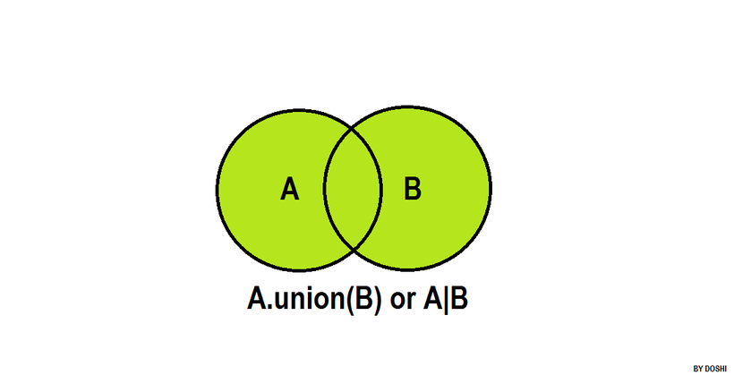

| [Previous Question](https://github.com/Kevin-Lago/python-hackerrank-solutions/tree/main/src/python/sets/set_discard_remove_and_pop)</img> | [Home](https://github.com/Kevin-Lago/python-hackerrank-solutions)</img> | [Next Question](https://github.com/Kevin-Lago/python-hackerrank-solutions/tree/main/src/python/sets/set_intersection_operation)</img> |
|:---|:---:|---:|

# Set .union() Operation



__.union()__

The .union() operator returns the union of a set and the set of elements in an iterable.

Sometimes, the | operator is used in place of .union() operator, but it operates only on the set of elements in set.

Set is immutable to the .union() operation (or | operation).

__Example__

```python
>>> s = set("Hacker")
>>> print s.union("Rank")
set(['a', 'R', 'c', 'r', 'e', 'H', 'k', 'n'])

>>> print s.union(set(['R', 'a', 'n', 'k']))
set(['a', 'R', 'c', 'r', 'e', 'H', 'k', 'n'])

>>> print s.union(['R', 'a', 'n', 'k'])
set(['a', 'R', 'c', 'r', 'e', 'H', 'k', 'n'])

>>> print s.union(enumerate(['R', 'a', 'n', 'k']))
set(['a', 'c', 'r', 'e', (1, 'a'), (2, 'n'), 'H', 'k', (3, 'k'), (0, 'R')])

>>> print s.union({"Rank":1})
set(['a', 'c', 'r', 'e', 'H', 'k', 'Rank'])

>>> s | set("Rank")
set(['a', 'R', 'c', 'r', 'e', 'H', 'k', 'n'])
```

---

__Task__

The students of District College have subscription to English and French newspapers. Some students have subscribed only to English, some have subscribed to only French and some have subscribed to both newspapers.

You are given two sets of student roll numbers. One set has subscribed to the English newspaper, and the other set is subscribed to the French newspaper. The same student could be in both sets. You task is to find the total number of students who have subscribed to at least one newspaper.

__Input Format__

The first line contains an integer, ___n___, the number of students who have subscribed to the English newspaper.

The second line contains ___n___ space separated roll numbers of those students.

The third line contains ___b___, the number of students who have subscribed to the French newspaper.

The fourth line contains ___b___ space separated roll numbers of those students.

__Constraints__

$0 < Total number of students in college < 1000$

__Output Format__

Output the total number of students who have at least one subscription.

__Sample Input__

```
9
1 2 3 4 5 6 7 8 9
9
10 1 2 3 11 21 55 6 8
```

__Sample Output__

```
13
```

__Explanation__

Roll numbers of students who have at least one subsription:

__1, 2, 3, 4, 5, 6, 7, 8, 9, 10, 11, 21__ and __55__. Roll numbers: __1, 2, 3, 6__ and __8__ are in both sets so they are only counted once.

Hence, the total is __13__ students.

---

<details><summary>Solution</summary>
    
```python
if __name__ == '__main__':
    n = int(input())
    a = set(map(int, input().split()))

    m = int(input())
    b = set(map(int, input().split()))

    print(len(a.union(b)))
```
</details>