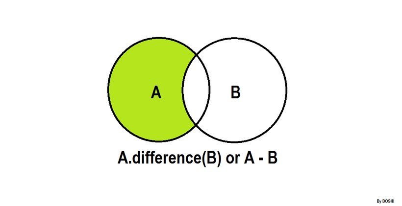

| [Previous Question](https://github.com/Kevin-Lago/python-hackerrank-solutions/tree/main/src/sets/set_intersection_operation)</img> | [Home](https://github.com/Kevin-Lago/python-hackerrank-solutions)</img> | [Next Question](https://github.com/Kevin-Lago/python-hackerrank-solutions/tree/main/src/sets/set_symmetric_difference_operation)</img> |
|:---|:---:|---:|

# Set .difference() Operation



__.difference()__

The tool .difference() returns a set with all the elements from the set that are not in an iterable.

Sometimes the ```-``` operator is used in place of the .difference() tool, but it only operates on the set of elements in set.

Set is immutable to the .difference() operation (or the ```-``` operation).

```python
>>> s = set("Hacker")
>>> print s.difference("Rank")
set(['c', 'r', 'e', 'H'])

>>> print s.difference(set(['R', 'a', 'n', 'k']))
set(['c', 'r', 'e', 'H'])

>>> print s.difference(['R', 'a', 'n', 'k'])
set(['c', 'r', 'e', 'H'])

>>> print s.difference(enumerate(['R', 'a', 'n', 'k']))
set(['a', 'c', 'r', 'e', 'H', 'k'])

>>> print s.difference({"Rank":1})
set(['a', 'c', 'e', 'H', 'k', 'r'])

>>> s - set("Rank")
set(['H', 'c', 'r', 'e'])
```

---

__Task__

Students of District College have a subscription to English and French newspapers. Some students have subscribed to only English newspaper, some have subscribed to only the French newspaper, and some have subscribed to both newpapers.

You are given two sets of student roll numbers. One set has subscribed to the English newspaper, and one set has subscribed to the French newspaper. Your task is to find the total number of students who have subscribed to only English newspapers.

__Input Format__

The first line contains the numbers of students who have subscribed to the English newspaper.

The second line contains the space separated list of student roll numbers who have subscribed to the English newspaper.

The third line contains the number os students who have subscribed to the French newspaper.

The fourth line contains the space separated list of student roll numbers who have subscribed to the French newspaper.

__Constraints__

$0 < Total number of students in college < 1000$

__Output Format__

Output the total number of students who are subscribed to the English newspaper only.

__Sample Input__

```
9
1 2 3 4 5 6 7 8 9
9
10 1 2 3 11 21 55 6 8
```

__Sample Output__

```
4
```

__Explanation__

The roll numbers of students who only have English newspaper subscription are:

__4, 5, 7__ and __9__.

Hence, the total is __4___ students.

---

<details><summary>Solution</summary>
    
```python
if __name__ == '__main__':
    n = int(input())
    a = set(map(int, input().split()))

    m = int(input())
    b = set(map(int, input().split()))

    print(len(a.difference(b)))
```
</details>