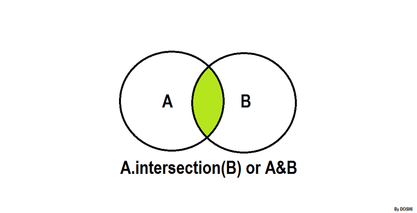

| [Previous Question](https://github.com/Kevin-Lago/python-hackerrank-solutions/tree/main/src/sets/set_union_operation)</img> | [Home](https://github.com/Kevin-Lago/python-hackerrank-solutions)</img> | [Next Question](https://github.com/Kevin-Lago/python-hackerrank-solutions/tree/main/src/sets/set_difference_operation)</img> |
|:---|:---:|---:|

# Set .intersection() Operation



__.intersection()__

The .intersection() operator retursn teh intersection of a set and the set elements in an iterable.

Something, the & operator is used in place of the .intersection() operator, but it only operators on the set of elements in set.

The set is immutable to the .intersection() operation (or & operation).

```python
>>> s = set("Hacker")
>>> print s.intersection("Rank")
set(['a', 'k'])

>>> print s.intersection(set(['R', 'a', 'n', 'k']))
set(['a', 'k'])

>>> print s.intersection(['R', 'a', 'n', 'k'])
set(['a', 'k'])

>>> print s.intersection(enumerate(['R', 'a', 'n', 'k']))
set([])

>>> print s.intersection({"Rank":1})
set([])

>>> s & set("Rank")
set(['a', 'k'])
```

---

__Task__

The students of District College have subscription to English and French newspaper. Some students have subscribed only to English, some have subscribed only to French, and some have subscribed to both newspapers.

You are given two sets of student roll numbers. One set has subscribed to the English newpaper, one set has subscribed to the French newspaper. You task is to find the total number of students who have subscribed to both newspaper.

__Input Format__

The first line contains ___n___, the number of student who have subscribed to the English newspaper.

The second line contains ___n___ space separated roll numbers of those students.

The third line contains ___b___, the number of students who have subscribed to the French newspaper.

The fourth line contains ___b___ space separated roll numbers of those students.

__Constraints__

$0 < Total number of student in college < 1000$

__Output Format__

Output the total number of students who have subscriptions to __both__ English and French newspapers.

__Sample Input__

```
9
1 2 3 4 5 6 7 8 9
9
10 1 2 3 11 21 55 6 8
```

__Sample Output__

```
5
```

__Explanation__

The roll numbers of students who have both subscriptions:

__1, 2, 3, 6__ and __8__.

Hence, the total is __5__ students.

---

<details><summary>Solution</summary>
    
```python
if __name__ == '__main__':
    n = int(input())
    a = set(map(int, input().split()))

    m = int(input())
    b = set(map(int, input().split()))

    print(len(a.intersection(b)))
```
</details>