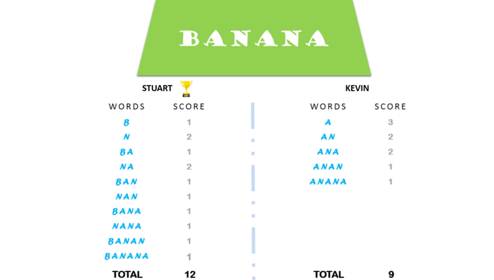

# The Minion Game

Kevin and Stuart want to play the '__The Minion Game__'.

__Game Rules__

Both players are given the same string, ___s___.

Both players have to make substrings using the letters of the string ___s___.

Stuart has to make words starting with consonants.

Kevin has to make words starting with vowels.

The game ends when both players have made all possible substrings.

__Scoring__

A player gets +1 point for each occurrence of the substring in the string ___s___.

__For Example:__

String ___s___ = BANANA

Kevin's vowel beginning word = ANA

Here, ANA occurs twice in BANANA. Hence, Kevin will get 2 points.

For better understanding, see the image below:



Your task is to determine the winner of the game and their score.

__Function Description__

Complete the minion_game in the editor below.

minion_game has the following parameters:

- string string: the string to analyze

__Prints__

- string: the winner's name and score, separated by a space on one line, or ```Draw``` if there is no winner.

__Input Format__

A single line of input containing the string ___s___.

__Note:__ The string ___s___ will contain only uppercase letters: __[A-Z]__.

__Constraints__

__0 <= _len(s)_ <= 10<sup>6</sup>__

__Sample Input__

```
BANANA
```

__Sample Output__

```
Stuart 12
```

__Note:__

Vowels are only defined as ```AEIOU```. In this problem, ```Y``` is not considered a vowel.

__Solution__

```python

```
